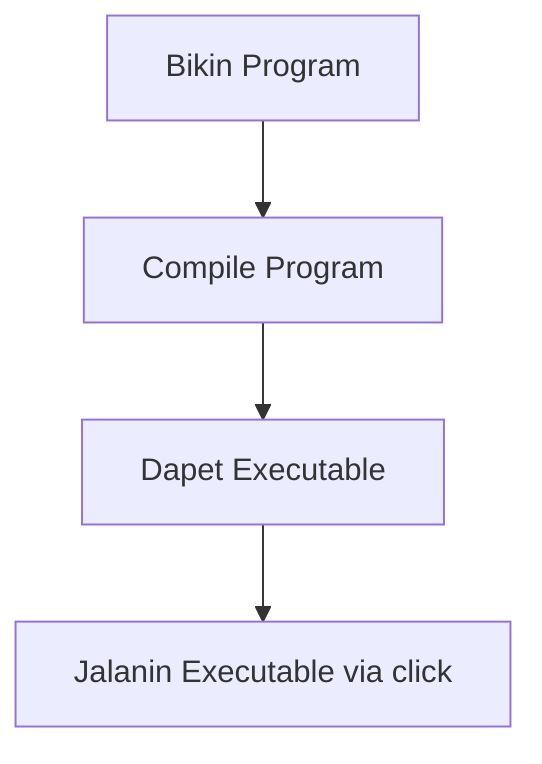
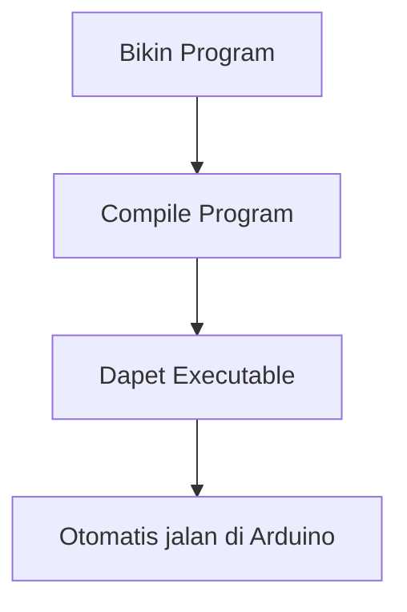

---
# try also 'default' to start simple
theme: seriph
# random image from a curated Unsplash collection by Anthony
# like them? see https://unsplash.com/collections/94734566/slidev
background: https://images.unsplash.com/photo-1551703616-e5a729ff0185?ixlib=rb-4.0.3&ixid=MnwxMjA3fDB8MHxwaG90by1wYWdlfHx8fGVufDB8fHx8&auto=format&fit=crop&w=2673&q=80
# apply any windi css classes to the current slide
class: 'text-center'
# https://sli.dev/custom/highlighters.html
highlighter: shiki
# show line numbers in code blocks
lineNumbers: false
drawings:
  persist: false
css: unocss
---

# Super brief introduction to arduino

---

# Content

- **Hello world**: upload existing program
- **Breaking down Arduino programming**: main & setup?
- **Example**: Code a simple input output program with arduino

<style>
h1 {
  background-color: #2B90B6;
  background-image: linear-gradient(45deg, #4EC5D4 10%, #146b8c 20%);
  background-size: 100%;
  -webkit-background-clip: text;
  -moz-background-clip: text;
  -webkit-text-fill-color: transparent;
  -moz-text-fill-color: transparent;
}
</style>

<!--
Here is another comment.
-->

---

# Main difference sama C++ biasa

<div grid="~ cols-2 gap-2" m="-t-2">
<div>

- C++ yang tadi



</div>

<div>

- Arduino nanti



</div>
</div>

---

# Hello world code

```cpp{all|1-3|5-8|all}
void setup() {
  Serial.begin(9600);
}

void main() {
    Serial.println("Hello World");
    delay(1000);
}
```

---

# Serial communication

Serial communication and debugging are essential to working with Arduino boards. Simply put, serial communication is a method that the board uses to communicate with other devices – such as another computer, a peripheral, etc.

```cpp{all|1-3|5|7-13|8-12|8|9|10|11|all}
void setup() {
  Serial.begin(9600);
}

String text;

void main() {
    while(Serial.available()){
        text = Serial.readString();  
        Serial.println(text);  
    }
}
```

---

# Cobain bikin program sendiri

Misalnya sekarang dikasih tugas buat ngebikin program yang bisa:
1. Nerima input nilai user sebanyak N kali, nilai-nya cuman bisa dari A-C
2. Nilai A = 80, B = 70, C = 60
3. Print hasil rata-rata outputnya kalau udah input sebanyak N kali

```cpp {monaco}
void setup() {
}

void main() {
}
```

---
layout: center
class: text-center
---

# Selesai!

Note yaa ini belum semua hal yang perlu dipelajari, boleh banget modulnya dibaca :D
