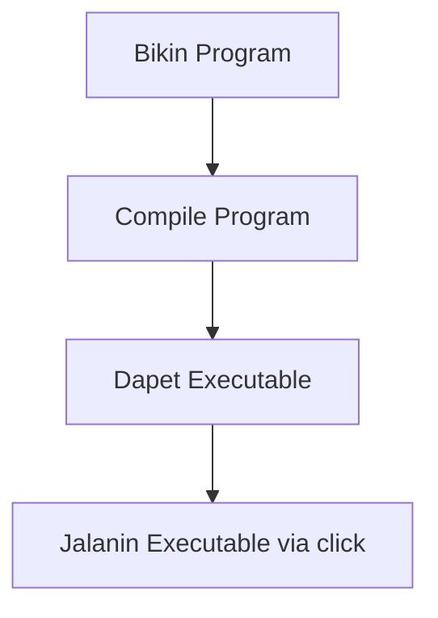
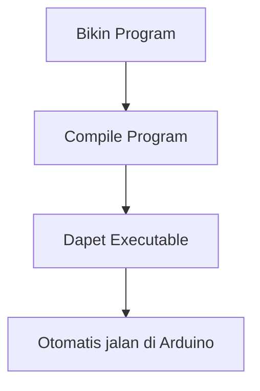

---
# try also 'default' to start simple
theme: seriph
# random image from a curated Unsplash collection by Anthony
# like them? see https://unsplash.com/collections/94734566/slidev
background: https://images.unsplash.com/photo-1603732551658-5fabbafa84eb?ixlib=rb-4.0.3&ixid=MnwxMjA3fDB8MHxwaG90by1wYWdlfHx8fGVufDB8fHx8&auto=format&fit=crop&w=1470&q=80
# apply any windi css classes to the current slide
class: 'text-center'
# https://sli.dev/custom/highlighters.html
highlighter: shiki
# show line numbers in code blocks
lineNumbers: false
# some information about the slides, markdown enabled
info: |
  ## Slidev Starter Template
  Presentation slides for developers.

  Learn more at [Sli.dev](https://sli.dev)
# persist drawings in exports and build
drawings:
  persist: false
# use UnoCSS
css: unocss
---

# Coding introduction for LTF II

<span>
    Sebuah tutorial yang diharapkan bisa membantu anda di LTF II 👍👍
</span>

---

# Content-nya apa aja?

Note that ini adalah semacam materi **hands-on** untuk membantu praktikan dalam melakukan programming dalam C++. Pembahasan yang ada disini akan lebih *praktikal* dengan example yang nyata untuk mengcover pembelajaran yang terlalu singkat di LTF modul 0. Berikut adalah kontennya

- **Apa sih C++** - Bahasa yang bakal dipake 1 semester ini dalam LTF.
- **Pengenalan ke variable & tipe-tipe data di C++** - C++ itu strongly typed language, maksudnya apa?
- **Loop, array, dan fungsi** - Building block utama dalam pemrograman.

Itu buat C++ nya, terus tambahan di bagian Arduinonya itu sebagai berikut.

- **Introduction to Arduino** - Intro awal banget apa itu Arduino, dll
- **I/O** - Apa itu serial dan contoh pake-nya

<style>
h1 {
  background-color: #2B90B6;
  background-image: linear-gradient(45deg, #4EC5D4 10%, #146b8c 20%);
  background-size: 100%;
  -webkit-background-clip: text;
  -moz-background-clip: text;
  -webkit-text-fill-color: transparent;
  -moz-text-fill-color: transparent;
}
</style>

---

# Apa itu C++?

C++ itu disebut low level language karena biasa digunakan untuk membangun sistem secara ground up (contohnya adalah Operating System, Interpreter, Embedded System, dll). Hal ini disebabkan karena kita bisa manage memory **langsung** dan ngga ada yang namanya **garbage collector**.

### Main difference

|  C++   |   Python  |
| --- | --- |
| Everything is strongly typed | Ngga ada "real typing system" |
| Jauh lebih cepet eksekusi-nya daripada python | Aga lambat |
| Outputnya adalah executables | Script harus dijalankan menggunakan interpreter |
| Lebih power untuk direct memory access & peripherals | limited |
| Error prone dan ngga begitu "human friendly" | Very beginner friendly |

---
layout: image-right
image: https://devclass.com/wp-content/uploads/2022/07/slide-1024x574.jpg
---

# Biasanya dipake apa?

- Embedded System
- Robotics
- Operating Systems
- Build System

Tapi karena ngga begitu friendly, banyak juga alternative language lain yang sedang rame di-develop seperti **Rust** dan **Carbon**.

<style>
h1 {
  background-color: #2B90B6;
  background-image: linear-gradient(45deg, #4EC5D4 10%, #146b8c 20%);
  background-size: 100%;
  -webkit-background-clip: text;
  -moz-background-clip: text;
  -webkit-text-fill-color: transparent;
  -moz-text-fill-color: transparent;
}
</style>


---

# Hello World

Perhatikan program berikut.

```cpp {all|1|3-6|3|5|4|1|all}
#include<stdio.h>

int main() {
    printf("Hello world!\n");
    return 0;
}
```

Gimana cara menjalankan program ini?

- Compile programnya (menggunakan gcc atau g++)
- Jalankan output executable biner-nya

<style>
.footnotes-sep {
  @apply mt-20 opacity-10;
}
.footnotes {
  @apply text-sm opacity-75;
}
.footnote-backref {
  display: none;
}
</style>

---
layout: center
---

# Sekarang nyobain langsung!


---

# Tadi ngapain?

Intinya udah ngerti bahwa: compiling program C++ akan mengeluarkan **binary executable** yang dapat dijalankan. Nah ini juga akan sama di konsep Arduino nanti, bedanya adalah:

<div grid="~ cols-2 gap-2" m="-t-2">
<div>

- C++ yang tadi



</div>

<div>

- Arduino nanti



</div>
</div>

---

# Variables
<span>
Variable konsepnya sama dengan apa yang ada di bahasa pemrograman lain, bedanya di C++ itu semuanya pake <strong>TYPE</strong>. Konsep type tu gimana?
</span>

Simplenya sih supaya ga ambigu, coba liat code python dibawah:

```py{all|1-2|4-5|all}
nim = "13320028"
print(nim + 10)

nim = 13320028
print(nim + 10)
```

Outputnya error kayak gini:

```
Traceback (most recent call last):
  File "/home/mazaya/Documents/project/ltf2/codes/modul-0/contoh-python.py", line
 2, in <module>
    print(nim + 10)
TypeError: can only concatenate str (not "int") to str
```

---

# Variables 

<span>
Nah ambigu kayak gitu gaada di c++, compiler-nya gabakal mau bikin executable kalau masih ada tipe yang ketuker. Contohnya misal:
</span>
```cpp{all|1-2|4-5|all}
int main() {
    int nim = 13320028;
    printf("%d", nim + 10);

    nim = "13320028";
    printf("%d", nim + 10);

    return 0;
}
```

Outputnya error kayak gini:

```
./variables-lesson-1.cpp: In function ‘int main()’:
./variables-lesson-1.cpp:7:9: error: invalid conversion from ‘const char*’ to ‘int’ [-fpermissive]
    7 |   nim = "13320028";
      |         ^~~~~~~~~~
      |         |
      |         const char*
```

---

# Variables

<span>
Lah sama-sama error toh? bedanya apa?
</span>

Kalau di C++ tadi itu errornya saat **compiling**, inget:


Kalau di Python tadi errornya itu saat **runtime**. Simplenya yang C++ itu error **sebelum dijalanin**, kalau python itu error **pas dijalanin**.

---

# Variables

<span>
di <strong>Arduino</strong> ada jenis apa aja? banyak sih, tapi yang penting-penting tu ini:
</span>

|  Jenis Variable |   Kegunaan  | Size |
| --- | --- | --- |
| char | nyimpen 1 huruf | 2 bit |
| String | nyimpen banyak huruf/char | 2 bit |
| int | nyimpen angka bisa negatif atau positif | 2 bit |
| uint | nyimpen angka bisa positif doang | 2 bit |

sisanya nanti belajar sendiri yak :) ada module-nya sendiri kalau dulu

---
align: center
---

# Cara pakenya gimana?

```cpp
type namaVariable = nilai;
```

misalnya:
```cpp
int umur = 20;
String nama = "Mazaya";
char inisial = 'M';
```

Ga harus langsung dikasih nilai juga sabi:
```cpp
int umur;
String nama;
char inisial;
```

Tapi hati-hati, kalau ga dikasih nilai berarti dia **null**.

---

# Variables

<span>
Maksudnya <strong>SIZE</strong> itu apa??
</span>

Nanti di sisdig belajar kalau representasi angka itu bisa pake biner. Jadi misalnya:

<span class="center">
1001 = 2^0 + 2^3 = 1 + 8 = 9
</span>

<span class="center">
1001 => (2^3)(2^2)(2^1)(2^0) => (2^3) x 1 + (2^2) x 0 + (2^1) x 0 + (2^0) x 1
</span>


<style>
.center {
    display: flex;
    align-items: center;
    justify-content: center;
}
</style>

---

# Variables

<span>
Nah ini penting karena nanti kalau misalnya kita menyimpan nilai yang terlalu besar, akan ada yang namanya overflow.
</span>

Overflow itu apa? simplenya adalah error kalau udah nilai variable kelebihan sizenya. Coba liat ilustrasinya.

```cpp{all|1-4|6-15|7|8|9-10|11|12|all}
#include <bitset>
#include <chrono>
#include <iostream>
#include <thread>

int main() {
  int val = 1;
  for (int i = 0; i < 60; i++) {
    std::cout << "Decimal: " << val << ", Binary: " << std::bitset<32>(val)
              << ", iterasi ke-" << i + 1 << std::endl;
    val <<= 1;
    std::this_thread::sleep_for(std::chrono::seconds(1));
  }
  return 0;
}
```

---

<div>
Langsung cobain aja ya programnya
</div>


<style>
div {
    display: flex;
    align-items: center;
    justify-content: center;
    width: 100%;
    height: 100%;
    background-color: #2B90B6;
    background-image: linear-gradient(45deg, #4EC5D4 10%, #146b8c 20%);
    background-size: 100%;
    -webkit-background-clip: text;
    -moz-background-clip: text;
    -webkit-text-fill-color: transparent;
    -moz-text-fill-color: transparent;
    font-size: 30px;
}
</style>

---

<div>
Variable dan tipe data selesai :)
</div>


<style>
div {
    display: flex;
    align-items: center;
    justify-content: center;
    width: 100%;
    height: 100%;
    background-color: #2B90B6;
    background-image: linear-gradient(45deg, #4EC5D4 10%, #146b8c 20%);
    background-size: 100%;
    -webkit-background-clip: text;
    -moz-background-clip: text;
    -webkit-text-fill-color: transparent;
    -moz-text-fill-color: transparent;
    font-size: 30px;
}
</style>

---

# Loop, array, dan fungsi

Sekarang kita masuk ke building block paling awal untuk pemrograman biasa. Nah ada 3 hal yang bakal dipelajarin sebagaimana tertulis di heading ppt slide ini.
___ 

## Array

Array itu ya sama persis sama List yang ada di python, bedanya apa? list di python itu disebut **dynamic array** karena tidak memiliki batas untuk diisi (kecuali memory), sedangkan array biasa di c++ itu ada batas jelas isi-nya bisa berapa.

```py
sebuahList = []
for i in range(10):
    sebuahList.append(i)

print(sebuahList)
```

Nanti outputnya:

```
[0, 1, 2, 3, 4, 5, 6, 7, 8, 9]
```

---


# Array

Sedangkan kalau di c++ cara bikin array tu gini

```cpp
type namaVariable[size];
```

Contohnya
```cpp
int nilai[10];
```

Berarti kita udah membuat integer dengan nama "nilai" dan bisa diisi 10 elemen. Bisa langsung diisi kayak gini:
```cpp
int nilai[10] = {0,1,2,3,4,5,5,6,7,8,9};
```

Atau assign setelah instansiasi:
```cpp
int nilai[10];
for(int i=0;i<10;i++) {
    nilai[i] = i;
}
```

---

# Array

Contohnya kalau kelebihan gimana?

```cpp{all|2|3|all}
int main() {
    int nilai[10];
    for(int i=0;i<20;i++) {
        nilai[i] = i;
    }
    return 0;
}
```

Nanti outputnya:

```
*** stack smashing detected ***: terminated
[1]    249088 IOT instruction (core dumped)  ./cpp-array
```

buat lebih ngerti apa maksudnya coba baca-baca tentang **stack memory**.

---

# Looping

Looping di c++ sama persis kayak looping di bahasa manapun, cuman beda syntax aja:

1. Python
```py
for i in range(100):
    print(i)
```

2. C++
```cpp{all|1|all}
for(int i=0;i<100;i++) {
    printf("%d\n", i);
}
```

formatnya kalau mau pake for-loop:
```cpp {monaco}
for(type variable=nilaiAwal; kondisi; lakukanSesuatu) {
    // block eksekusi-nya
}
```

---

# Looping

Ada juga jenis looping lain yang namanya do-while sama while.

1. While
```cpp {monaco}
while(kondisi) {
    // block eksekusi-nya
}
```

2. Do-While
```cpp {monaco}
do {
    // block eksekusi-nya
} while(kondisi)
```

A little bit about kondisi, syntax yang valid tu kek gini:
```cpp {monaco}
int nilai = 2;

// pengennya check nilai lebih dari 2 dan kurang dari 10 gimana?
```

---

# Fungsi

Sebenernya analoginya persis sama fungsi matematika (dan quite frankly ya emang fungsi yang sama dengan fungsi matematika) tapi praktikalnya mah gini: **intinya fungsi itu suatu hal yang dikasih input terus keluar output**.

Contohnya? misal kita punya fungsi kayak gini:

<span class="center">
    f(a,b) = a + b
</span>

dengan a dan b adalah konstanta. 

kita bisa replicate fungsi diatas, itu menggunakan fungsi di python misalnya jadi kek berikut.

```py
def f(a,b):
    return a+b
```

se-simple itu, yang mungkin aga rasanya aneh di pemrograman itu input fungsi ga selalu angka, tapi bisa juga String misalnya.

```py {monaco}
def namaLengkap(namaAwal, namaAkhir):
    return ...
```


<style>
.center {
    display: flex;
    align-items: center;
    justify-content: center;
}
</style>

---

# Fungsi

Terus cara pake fungsi di C++ gimana?

```cpp
returnType namaFungsi(typeArgument namaArgument) {
    return nilaiYangDiReturn;
}
```

kalau balik lagi ke analogi matematika

<span class="center">
    f(a,b) = a + b
</span>

a dan b yang dimasukkan kedalam f, itu disebut argument. dalam kasus berikut.

```cpp {monaco}
// lengkapi tipe-nya
type f(int a, int b) {
    return a+b;
}
```

<div v-click="1">
a dan b adalah argument dengan tipe integer. dan return type yang kita mau adalah integer.
</div>

<style>
.center {
    display: flex;
    align-items: center;
    justify-content: center;
}
</style>

---

# Fungsi

Tapi spesial-nya fungsi di pemrograman juga dia ngga selalu mengembalikan suatu nilai. Contoh paling gampangnya itu adalah fungsi printf.

```cpp {monaco}
// fungsi yang mengembalikan sesuatu
type f(int a, int b) {
    return a+b;
}
int c = f(10,20);

// fungsi yang tidak mengembalikan sesuatu
printf("%d\n", c);
```

Meskipun ngga mengembalikan apa-apa, inget di C++ semua harus ada tipenya. Jadi harus tetep ada return type-nya. Nah tipe yang kayak gini disebut void. Misalnya:

```cpp
void printHello() {
    printf("Hello\n");
}
```

---

# Fungsi

Gitu doang? well iya, tapi kalau praktikal-nya sih di pemrograman fungsi juga dipake buat nge-reduce repetisi. misalnya.

```cpp{all|6-10|11-15|16-20|all}
int nilaiUAS[100] = { ... };
int nilaiUTS[100] = { ... };
int nilaiQuiz[100] = { ... };
int main() {
    float rerataUAS = 0;
    for(int i=0;i<100;i++) {
        rerataUAS += nilaiUAS[i];
    }
    rerataUAS = rerataUAS/100;
    float rerataUTS = 0;
    for(int i=0;i<100;i++) {
        rerataUTS += nilaiUTS[i];
    }
    rerataUTS = rerataUTS/100;
    float rerataQuiz = 0;
    for(int i=0;i<100;i++) {
        rerataQuiz += nilaiQuiz[i];
    }
    rerataQuiz = rerataQuiz/100;
    printf("%d %d %d", rerataUAS, rerataUTS, rerataQuiz);
}
```

---

# Fungsi

Bisa diubah jadi sebagai berikut.

```cpp
int nilaiUAS[100] = { ... };
int nilaiUTS[100] = { ... };
int nilaiQuiz[100] = { ... };

float itungRerata(int nilai[]) {
    float rerata = 0;
    for(int i=0;i<100;i++) {
        rerata+=nilai[i];
    }
    return rerata/100;
}

int main() {
    float rerataUAS = itungRerata(nilaiUAS);
    float rerataUTS = itungRerata(nilaiUTS);
    float rerataQuiz = itungRerata(nilaiQuiz);
    printf("%d %d %d", rerataUAS, rerataUTS, rerataQuiz);
}
```

---

# Fungsi

Fungsi juga introducing suatu hal yang disebut dengan **scope**. Simplenya sih gini:

```
Variable yang muncul dalam batas {} gabisa diakses diluar {}. 
Tapi yang diluar {} bisa diakses di dalam {} (global variable biasanya).
```

Contohnya:

```cpp {monaco}
// ini bisa

int nilai = 0;

int main() {
    nilai = 10;
}

// ini gabisa

int main() {
    int c = 10;
}
c = 12;
```

---

# Conditionals

Ada 2 jenis conditionals di C++, sama aja kayak python cuman beda syntax.


<div grid="~ cols-2 gap-2" m="-t-2">

<div>

C++

```cpp {monaco}
if(kondisi_1) {
    // lakukan sesuatu
} else if (kondisi_2) {
    // lakukan sesuatu
} else {
    // lakukan sesuatu
}
```
</div>

<div>

Python

```py
if kondisi_1:
    # lakukan sesuatu
elif kondisi_2:
    # lakukan sesuatu
else:
    # lakukan sesuatu
```

</div>

</div>

<div v-click="1">
    Inget 1 hal: return type sebuah conditionals itu harus selalu boolean (bool). Jadi diatas juga si condition itu bisa di extract dalam 1 variable tertentu.
</div>
<div v-click="1">
    Inget juga bahwa <strong>Scope juga berlaku di conditionals</strong>
</div>

---
layout: image-right
image: https://cdn.programiz.com/sites/tutorial2program/files/cpp-switch-flowchart.png
---

# Conditionals

Selain if else, ada juga **switch case**.

```cpp {monaco}
switch (expression)  {
    case constant1:
        // code to be executed if 
        // expression is equal to constant1;
        break;
    case constant2:
        // code to be executed if
        // expression is equal to constant2;
        break;
    default:
        // code to be executed if
        // expression doesn't match any constant
}
```

---
layout: center
class: text-center
---

# Selesai! buat bagian pengenalan singkat ke c++ udah "rada aman", sekarang bakal lanjut ke dasar-dasar di arduino.
